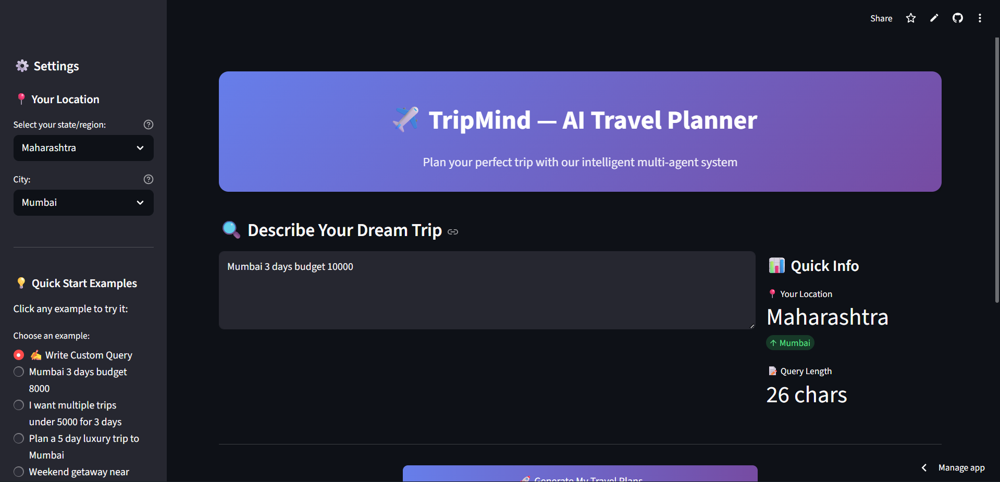
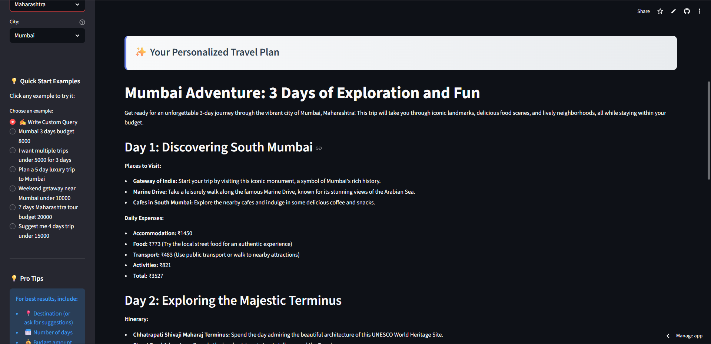
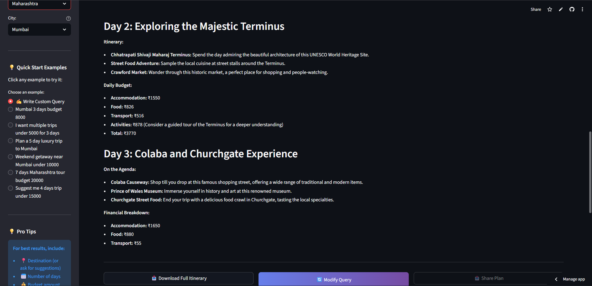

# 🌍 TripMind

**AI-Powered Multi-Agent Travel Planning System**

[](https://www.python.org/)
[](https://streamlit.io/)
[](LICENSE)

> Transform natural language queries into detailed, budget-conscious travel plans using state-of-the-art AI models.

---

## 📋 Table of Contents

- [Overview](#overview)
- [Key Features](#key-features)
- [System Architecture](#system-architecture)
- [Technology Stack](#technology-stack)
- [Installation](#installation)
- [Configuration](#configuration)
- [Usage](#usage)
- [Multi-Agent System](#multi-agent-system)
- [Cost Calculation](#cost-calculation)
- [Results](#results)
- [Deployment](#deployment)
- [Contributing](#contributing)
- [Authors](#authors)
- [License](#license)

---

## 🎯 Overview

TripMind is an intelligent travel planning system that leverages multiple Large Language Models (LLMs) in a multi-agent architecture. The system integrates **Groq's Llama and Qwen models** with **Cohere's Command models** to provide comprehensive trip planning including query resolution, itinerary generation, cost estimation, and natural language summarization.

Built with Python and Streamlit, TripMind transforms natural language queries into detailed, budget-conscious travel plans tailored to your preferences.

---

## ✨ Key Features

- 🗣️ **Natural Language Processing** - Simply describe your travel plans in plain English
- 🤖 **Multi-Model LLM Integration** - Powered by Llama 3.3, Qwen 3, and Command-R models
- 💰 **Budget Optimization** - Detailed cost breakdowns with budget compliance checking
- 📍 **Location-Aware Planning** - Destination recommendations based on your location
- 🎨 **Three Itinerary Styles** - Choose from Relaxed, Balanced, or Packed schedules
- 🖥️ **Interactive Web Interface** - User-friendly Streamlit application
- 🏛️ **Cultural Intelligence** - Recommendations include historical and cultural sites
- 📊 **Comprehensive Cost Analysis** - Category-wise expense tracking

---

## 🏗️ System Architecture

TripMind implements a **sequential multi-agent architecture** with specialized agents working in harmony:

```
User Query → Query Resolver → Planner → Cost Estimator → Summarizer → Output
```

### Multi-Agent Pipeline

1. **Query Resolver** - Extracts structured information from natural language
2. **Planner** - Generates detailed day-by-day itineraries
3. **Cost Estimator** - Calculates comprehensive cost estimates
4. **Summarizer** - Creates engaging natural language reports

---

## 🛠️ Technology Stack

### Backend
- **Python 3.13.7** - Core programming language
- **Streamlit** - Web application framework
- **Requests** - HTTP library for API calls
- **Python-dotenv** - Environment variable management
- **Regex & JSON** - Data parsing utilities

### AI Models
- **Groq API**
  - Llama 3.3-70B-Versatile
  - Qwen 3-32B
- **Cohere API**
  - Command-R-08-2024
  - Command-R+-08-2024

---

## 📦 Installation

### Prerequisites
- Python 3.x installed
- API keys for Groq and Cohere

### Setup Instructions

1. **Clone the repository**
```bash
git clone https://github.com/yourusername/tripmind.git
cd tripmind
```

2. **Install dependencies**
```bash
pip install -r requirements.txt
```

3. **Create `.env` file**
```bash
touch .env
```

4. **Add your API keys to `.env`**
```env
GROQ_API_KEY=your_groq_api_key_here
COHERE_API_KEY=your_cohere_api_key_here
```

---

## ⚙️ Configuration

### Requirements File (`requirements.txt`)

```txt
streamlit==1.28.0
requests==2.31.0
python-dotenv==1.0.0
```

### Model Configuration

| Agent | Model | Temperature |
|-------|-------|-------------|
| Query Resolver | Command-R-08-2024 | 0.3 |
| Planner | Llama 3.3-70B | 0.7 |
| Cost Estimator | Qwen 3-32B | 0.3 |
| Summarizer | Command-R+-08-2024 | 0.7 |

---

## 🚀 Usage

### Running the Application

```bash
streamlit run app.py
```

The application will open in your default browser at `http://localhost:8501`

### Example Queries

- "I want to travel to Goa for 5 days with a budget of 15000"
- "Plan a 3-day trip to Jaipur, budget-friendly, relaxed pace"
- "Mumbai weekend trip under 10000 rupees"

### Interface Components

**Sidebar:**
- Location selection (23+ states, 100+ cities)
- Quick start query templates
- Pro tips for effective queries

**Main Area:**
- Natural language query input
- Real-time processing feedback
- Detailed travel plan output
- Cost breakdown visualization

---

## 🤖 Multi-Agent System

### Agent 1: Query Resolver
**Model:** Cohere Command-R-08-2024

Extracts structured information:
- State and city
- Trip duration and budget
- Travel style preferences
- Top 5 destination attractions

### Agent 2: Planner
**Model:** Groq Llama 3.3-70B-Versatile

Generates three itinerary styles:

| Style | Activities/Day | Pace | Cost Multiplier |
|-------|---------------|------|-----------------|
| Relaxed | 2-3 | Slow | 0.85x |
| Balanced | 4-5 | Moderate | 1.0x |
| Packed | 6-8 | Fast | 1.2x |

### Agent 3: Cost Estimator
**Model:** Groq Qwen 3-32B

Three-phase cost calculation:
1. **Baseline Cost Acquisition** - Query LLM for daily costs
2. **Style-Based Adjustment** - Apply multipliers
3. **Daily Variation** - Simulate realistic fluctuations

Formula:
```
variation = 0.9 + 0.2 × (day_num / total_days)
```

### Agent 4: Summarizer
**Model:** Cohere Command-R+-08-2024

Transforms structured data into engaging markdown reports with:
- Executive summary
- Day-by-day narrative
- Budget visualization
- Practical tips

---

## 💵 Cost Calculation

### Cost Categories
- 🏨 **Accommodation** - Hotels, hostels, guesthouses
- 🍽️ **Food** - Meals and dining expenses
- 🚗 **Transport** - Local travel and commute
- 🎭 **Activities** - Attractions, tours, experiences

### Example Cost Breakdown

```json
{
  "day": 1,
  "daily_cost": 3312,
  "cost_breakdown": {
    "accommodation": 1350,
    "food": 720,
    "transport": 450,
    "activities": 792
  }
}
```

---

## 📊 Results







### Key Features Demonstrated
✅ Accurate budget extraction and compliance  
✅ UNESCO World Heritage Site recommendations  
✅ Realistic cost variations per day  
✅ Detailed expense breakdowns  
✅ Clean, structured presentation  

---

## 🌐 Deployment

https://tripmind-ai-travel-planner.streamlit.app/

### Environment Variables for Production

Ensure these are set in your deployment environment:
```
GROQ_API_KEY=<your_key>
COHERE_API_KEY=<your_key>
```

---

## 🤝 Contributing

We welcome contributions! Here's how you can help:

1. Fork the repository
2. Create a feature branch (`git checkout -b feature/AmazingFeature`)
3. Commit your changes (`git commit -m 'Add some AmazingFeature'`)
4. Push to the branch (`git push origin feature/AmazingFeature`)
5. Open a Pull Request

---

## 👥 Authors

 - [**Pratyay Koley**](https://github.com/PratyayKoley)
 - [**Rohit Patra**](https://github.com/RohitPatra007)

📅 Last Updated: October 8, 2025

---

## 📄 License

This project is licensed under the MIT License - see the [LICENSE](LICENSE) file for details.

---

## 🙏 Acknowledgments

- **Groq** for providing high-performance LLM inference
- **Cohere** for powerful language models
- **Streamlit** for the excellent web framework
- The open-source community for inspiration and support

---